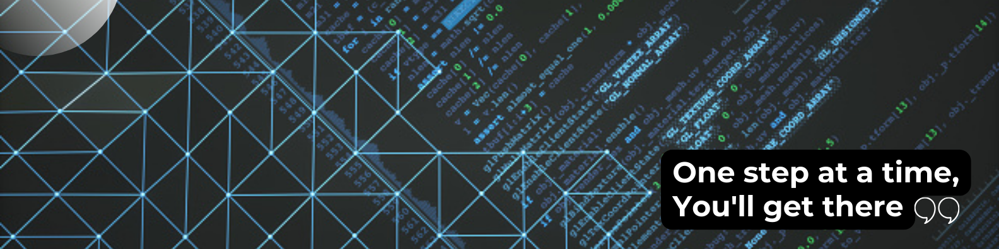

</a>

<h3 align="center">A driven full-stack developer based in Toronto, Canada. I happen to enjoy solving programming problems I have never seen or heard of before.   Note: I have switched over to Azure DevOps for Projects</h3>

<h3 align="left">Connect with me 🤝:</h3>

 

<h3 align="left">Languages and Tools:</h3>

 
  

 
 

<b>:book: &nbsp;𝙰𝚋𝚘𝚞𝚝 𝙼𝚎</b>

 

  
"I'm a Software Developer - Integrations @ILAC and find fulfilment in developing complex software, integrations, automating workflows, and occasionally attending meetups in Toronto (usually related to Microsoft Technology). I focus on maintainability, performance, and readability with all of my projects and strive to follow the best practices."

 

  []

  
<b>:gear: &nbsp;GitHub Statistics - Click to Expand</b>

   
    

        
    

    

         
    

